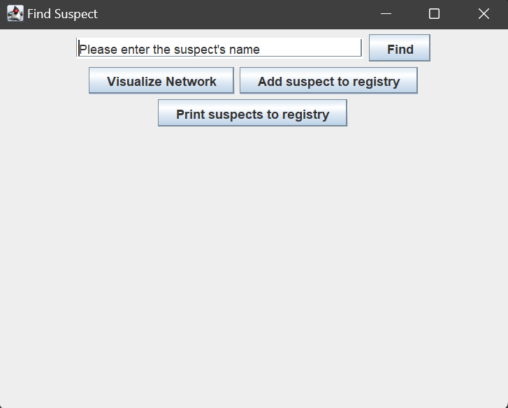
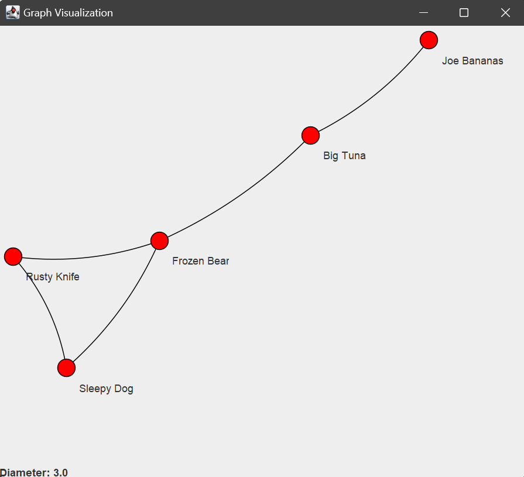

# 🕵️ Crime Management System

> **An advanced Java-based investigative platform for tracking suspects, analyzing communications, and visualizing criminal networks.**

The **Crime Management System** is a modular application designed to simulate real-world forensic analysis. It enables investigators to manage suspect profiles, log multi-channel communications (SMS/Calls), and uncover hidden social connections using **Graph Theory** and the **JUNG (Java Universal Network/Graph) Framework**.

---

## 📌 System Architecture

The project follows a **Modular Object-Oriented Design**, ensuring high maintainability and clear separation of concerns:

```text
       [ GUI Layer (Swing) ]
      (FindSuspect / SuspectPage)
                 |
                 v
      [ Logic Layer (Registry) ] <------- [ Graph Analysis ]
                 |                        (Triangular Closure)
        /--------+--------\
        |                 |
 [ Suspect Data ]   [ Communications ]
 (Profiles/Phones)   (SMS / PhoneCalls)
        |                 |
        \--------+--------/
                 |
                 v
      [ Data Layer (File I/O) ]
```

### 🔹 Key Class Responsibilities
* **Registry:** The central data hub; manages the collections of suspects and orchestrates the analysis.
* **Suspect:** Handles individual attributes, including the "triangular closure" logic for suggesting potential partners.
* **Communication (Abstract):** The base for `PhoneCall` and `SMS` subclasses, utilizing polymorphism for record-keeping.
* **Visualize:** Leverages the **JUNG Framework** to render the suspect network and calculate the graph's diameter.

---

## 🚀 Core Features

### 🔍 Suspect & Partner Management
* **Dynamic Profiles:** Add suspects with codenames, multiple phone numbers, and home cities.
* **Triangular Closure Rule:** Automatically suggests potential partners by identifying common associates in the network.


### 📞 Communication Tracking
* **Multi-Modal Logs:** Distinguish between SMS (content-based) and Phone Calls (duration-based).
* **Suspicious Activity:** Flag and filter messages based on specific criteria within the Registry.

### 📊 Network Visualization
* **Interactive Graphs:** Dynamic node/edge rendering to explore relationships visually.
* **Mathematical Analysis:** Calculation of the **Network Diameter** (the longest shortest path) to assess the reach of a criminal ring.

### 📝 Reporting & Export
* **File Integration:** Export detailed suspect records to standardized `.txt` files.
* **Data Integrity:** Strict input validation for phone formats and required fields.

---

## 🧰 Technical Stack

| Category | Technology |
| :--- | :--- |
| **Language** | Java (OOP Principles) |
| **GUI** | Java Swing |
| **Graphing** | JUNG (Java Universal Network/Graph Framework) |
| **Data Structures** | ArrayLists, HashMaps, Graph Collections |
| **Persistence** | Java I/O (Text-based Export) |

---

## 🛠 Installation & Setup

### Prerequisites
* **Java JDK 8 or higher** installed.
* **JUNG Libraries** (`jung-graph-impl`, `jung-visualization`, etc.) added to your build path.

### Steps
1. **Clone the repository:**
   ```bash
   git clone [https://github.com/AngelosFikias0/Crime_Management_System.git](https://github.com/AngelosFikias0/Crime_Management_System.git)
   ```
2. **Compile the source:**
   ```bash
   javac -cp "lib/*" src/*.java -d bin
   ```
3. **Run the application:**
   ```bash
   java -cp "bin:lib/*" Main
   ```

---

## 📸 Interface Preview

| Dashboard | Network Graph |
| :---: | :---: |
|  |  |
| *Suspect Lookup & Entry* | *Relational Analysis* |

---

## 📈 Future Roadmap

- [ ] **Database Integration:** Migrate from in-memory/file storage to **MySQL** or **SQLite**.
- [ ] **Modernized UI:** Transition from Swing to **JavaFX** for enhanced styling and animations.
- [ ] **Geolocation:** Integrate maps to visualize suspect distribution by city.

---

## 📄 About the Author
Developed by **Angelos Fikias** as a showcase of analytical software engineering, algorithmic processing, and robust system architecture.

---
*Built with passion for clean code and forensic logic.*
