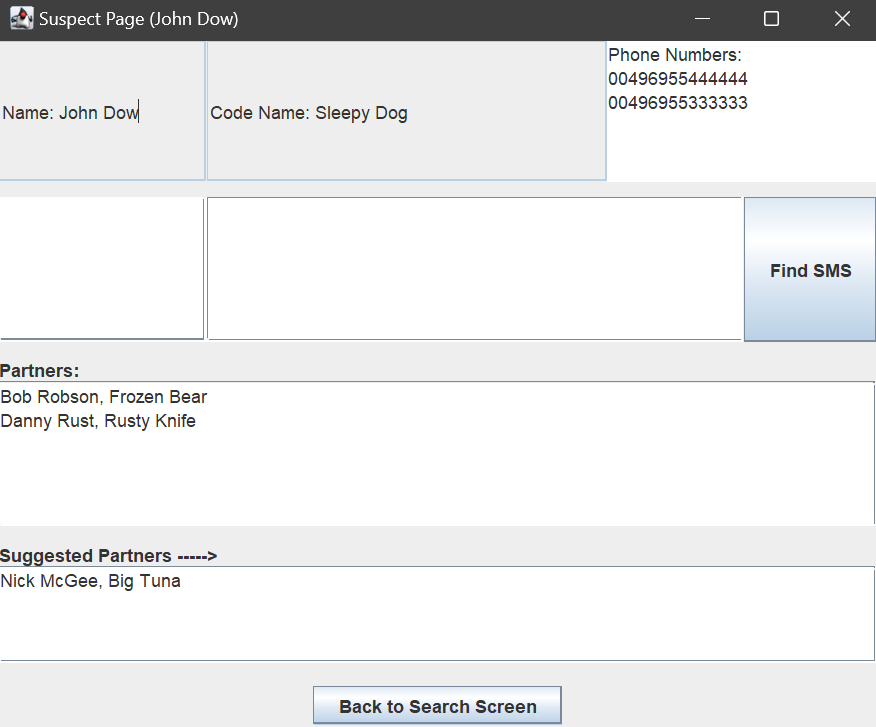
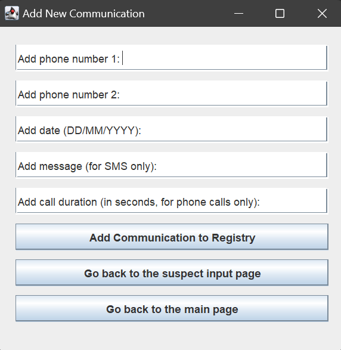
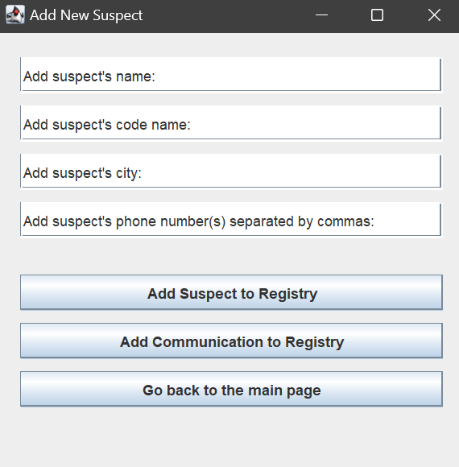

Crime Management System
=======================

📌 Overview
-----------

The **Crime Management System** is a sophisticated Java application designed to simulate an investigative platform where administrators can track and manage suspects, their communications, and their networks. The system enables users to add suspects with key details, log communications in the form of SMS or phone calls, and analyze social connections using graph visualization techniques.

This project demonstrates expertise in **Object-Oriented Programming (OOP), Java Swing (GUI development), file handling, data structures, and system architecture**, making it a prime showcase of analytical thinking, problem-solving, and system design skills.

🚀 Features
-----------

### 🔍 **Suspect Management**

*   Add suspects with **name, codename, city, and phone numbers**.
    
*   View suspect details, including their partners and suggested partners based on the **triangular closure rule**.
    
*   Add additional phone numbers dynamically.
    

### 📞 **Communication Tracking**

*   Record **SMS messages and phone calls** between suspects.
    
*   Store and analyze communications in a **Registry**, which serves as the backbone of the system.
    
*   Identify suspicious messages and interactions.
    

### 📊 **Network Visualization & Analysis**

*   Generate an interactive **graph-based visualization** of the suspect network using **JUNG (Java Universal Network/Graph Framework)**.
    
*   Analyze the **diameter of the graph** (longest shortest path between two nodes).
    
*   Easily identify key suspects and their relationships.
    

### 📝 **Data Management & Export**

*   Search for suspects and retrieve detailed information.
    
*   Export suspect records to a **text file** for reporting purposes.
    
*   Validate input fields for **error-free data entry**.
    

🎨 User Interface
-----------------

### 🏠 **Main Dashboard**

*   Search for a suspect by name to view their details.
    
*   Add new suspects and communications.
    
*   Visualize the network of suspects using **graph representation**.
    
*   Print the suspect list as a **text file**.
    

### 📄 **Suspect Details Page**

*   Displays **basic details, phone numbers, and existing communications**.
    
*   Input area to add **new phone numbers**.
    
*   Search functionality to filter SMS messages.
    
*   Suggested partners feature using **triangular closure analysis**.
    

### 📊 **Network Visualization**

*   Interactive **graph layout** to explore suspect connections.
    
*   Dynamic node and edge rendering.
    
*   Calculation and display of the **network's diameter**.
    

### 📥 **Data Entry Forms**

*   Add suspects with **validation for name, codename, city, and phone numbers**.
    
*   Log communications by distinguishing between **SMS and phone calls**.
    
*   User-friendly input fields with placeholder handling.
    

🏗 System Architecture
----------------------

The project follows a **modular and object-oriented approach**, ensuring scalability, maintainability, and ease of extension.

### 🔹 **Key Classes & Responsibilities**

*   **Main**: Initializes the system with preset suspects and communications, and launches the main GUI.
    
*   **Registry**: Central data repository managing suspects and communications, performing key analysis.
    
*   **Suspect**: Represents an individual suspect with attributes like **name, codename, city, phone numbers, and partnerships**.
    
*   **Communication (Abstract)**: Base class defining shared attributes for different communication types.
    
    *   **PhoneCall**: Inherits from Communication, stores call duration, and implements printInfo().
        
    *   **SMS**: Inherits from Communication, stores message content, and implements printInfo().
        
*   **FindSuspect**: Main GUI class for suspect lookup and system navigation.
    
*   **SuspectPage**: Displays details about a specific suspect.
    
*   **Visualize**: Generates the suspect network visualization using **JUNG**.
    
*   **Input**: GUI class for adding new suspects.
    
*   **CommsInput**: Handles input of **SMS and phone call records**, validates fields, and updates the registry.
    

🔧 Technologies & Skills Used
-----------------------------

*   **Java (OOP, Data Structures, System Design)**
    
*   **Java Swing (GUI Development)**
    
*   **JUNG (Graph Visualization & Analysis)**
    
*   **File Handling (Java I/O)**
    
*   **Graph Theory (Triangular Closure, Network Diameter Calculation)**
    
*   **Algorithm Design & Data Processing**
    

💼 Why This Project Stands Out
------------------------------

*   **Demonstrates expertise** in **Java programming, system design, and GUI applications**.
    
*   Implements **graph-based analysis** for real-world crime investigation scenarios.
    
*   Uses **data validation, file management, and visualization** techniques.
    
*   Showcases a **well-structured, modular system**, built for **extensibility and maintainability**.
    

📌 Future Enhancements
----------------------

*   Integration with **databases (e.g., MySQL, SQLite) for persistent storage**.
    
*   Enhance UI with **modern JavaFX styling**.
    

📸 Screenshots
--------------

Here are some key screenshots of the **Crime Management System**:

### 1️⃣ **Main Dashboard**

### 2️⃣ **Suspect Details Page**

### 3️⃣ **Communication Logging**

### 4️⃣ **Network Visualization**

### 5️⃣ **Add Suspect Form**

📢 Final Thoughts
-----------------

The **Crime Management System** is a testament to **strong problem-solving, software architecture, and Java development skills**. By combining **OOP principles, graph theory, and intuitive GUI design**, this project demonstrates the ability to build **scalable, analytical, and real-world applications**.

🚀 _Built with passion and precision!_